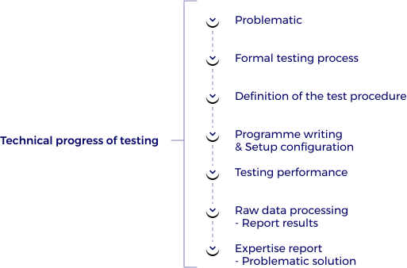

Knowing that every company and every project is **unique**, MTA Test Platform offers a wide range of test services for various industries and provide tailored packages to meet your specific needs (see ESS section). Our knowledge and industry expertise enable us to support our clients at all stages of their R&D project lifecycle and thus innovate and adapt to your specific business and company. You can rely on MTA to deliver expert integrated solutions. We can help optimize the engineering and technical aspects of every phase of your test project, including work on the problem, beneficial training services, formalization of the need for tests but also provide a systemic approach to supporting our customers afterwards through raw data processing, results expertise and detailed reports of your tests.

At MTA, we always try to make our customers’ **uniqueness** shine through by providing customized services designed to ensure the efficiency of your project and to meet your specific needs. With over 10 years of experience, our expertise ensures your projects are prepared to meet evolving demands.
