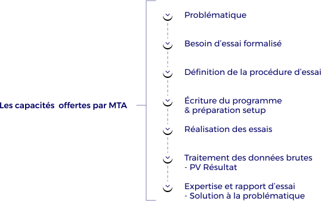

MTA plateforme d’essais propose à ses clients toute une panoplie de tests et de mesures ([voir section SSE](/systemes-de-stockage-denergie-electrique)) lors de leurs projets de recherche et de développement. Dans ce cadre MTA met à disposition de ses clients les compétences de ses équipes afin de les accompagner de manière individuelle.  

Nous comprenons que chaque entreprise et chaque projet est **unique**. C’est pourquoi nous nous adaptons pour répondre au mieux à vos besoins. Nos compétences nous permettent ainsi de vous accompagner très en amont (travail sur la problématique, formation de personnel, formalisation du besoin d’essais) mais également en aval (traitement des données brutes, expertise des résultats, rapports détaillés) de vos essais. 

Cet accompagnement de nos clients est **personnalisé** en fonction de vos besoins, de vos capacités et de votre projet. Nous sommes là pour vous aider, au plus juste, et en vous faisant profiter de notre expérience.
