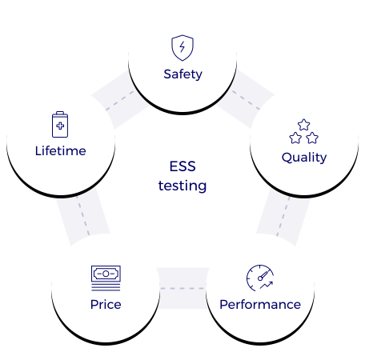

    During the development phase of an ESS, MTA can help you to optimize the production process with our tests facilities by addressing some critical issues:

* Safety
* Quality
* Performance
* Price
* Lifetime

These are important points to be consistently verified throughout the ESS development to meet application requirements. Accordingly, our SSE testing solutions allow our customers to:
 

* **Benchmark** different battery manufacturers and select one relevant cell for its performance.
* **Characterize** their ESS in order to provide baseline information and precisely define their performances.
* **Obtain** the electrical and thermal characteristics of their ESS to enhance their modeling capabilities.
* Achieve **endurance** or aging behavior and accelerate aging protocols on ESS in order to know, model and optimize the life prediction of their product.
* Play complex scenarios for **developing the suitable BMS** of their battery (transitions, security, status indicators ...)

