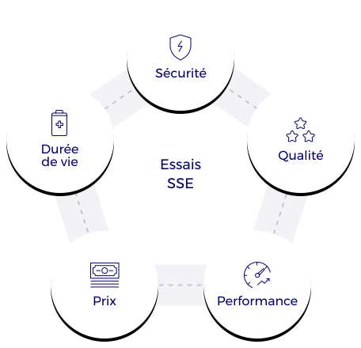

Lors d’un développement par une entreprise d’un produit contenant un SSE il convient de veiller à plusieurs points importants :
* La sécurité
* La qualité
* La performance
* Le prix
* La durée de vie

Ces points importants du produit sont à mettre au point et à vérifier pendant toute la durée du développement. Les essais sur SSE permettent ainsi à nos clients de :
* **Benchmarker** différents fournisseurs d’accumulateurs et de sélectionner un élément parmi d’autre pour ses performances.
* **Caractériser** leurs SSE afin de connaitre et définir précisément leurs performances.
* Obtenir les caractéristiques électriques et thermiques des SSE dans un objectif de **modélisation**.
* Réaliser des **endurances** (ou vieillissement) accélérer des SSE afin de connaitre, de modéliser et d’optimiser la durée de vie de son produit.
* Jouer des scénarios complexes afin de **mettre au point** le BMS de leur batterie (transitions, sécurité, indicateurs d’état…)
