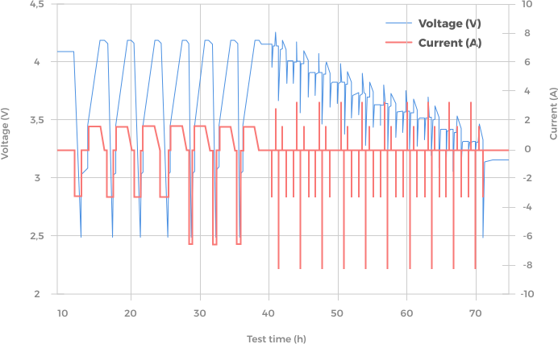

Au démarrage d’un projet, un industriel nous contacte dans le cadre d’un projet de création d’une batterie pour le transport aérien. Nous lui proposons alors une première phase de sélection de cellule Li-ion afin de déterminer celle qui contient le plus d’énergie et la plus forte puissance. La procédure est la suivante :

{.over-left}
