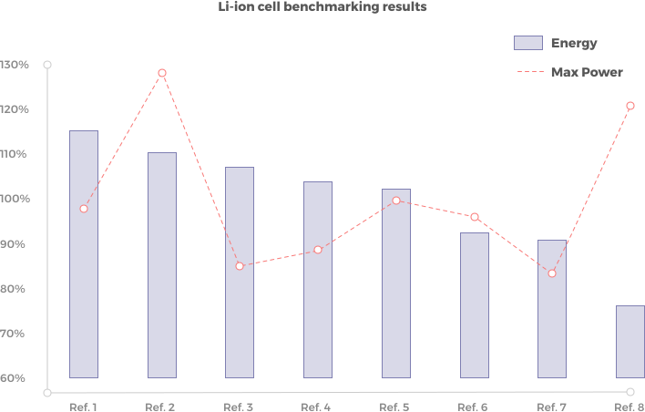

The work completed by MTA operators and engineers makes it possible to process the raw results obtained and to draw the following graph:

{.over-left}

Based on **customer’s need**, MTA will recommend reference 1 for its excellent energy density but above all reference 2 that is the best Energy / Power tradeoff.

