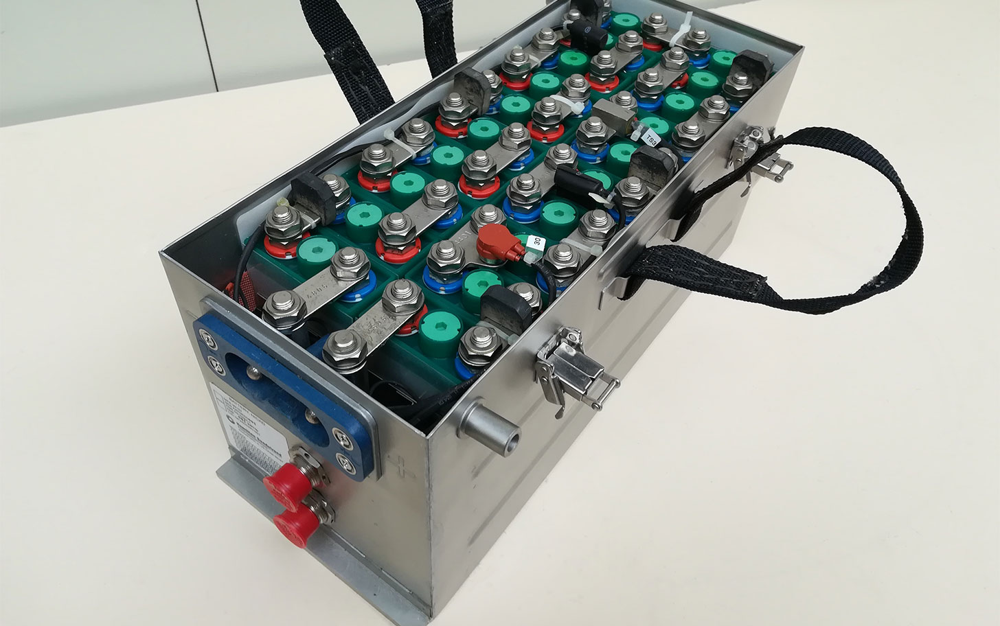

Le matériel proposé pour les essais SSE est le suivant :




{{first_image}}

    

{{ p.content }}



[owl-carousel items=1 margin=40 loop=true autoplay=true autoplayHoverPause=true nav=true dots=false]

[/owl-carousel]