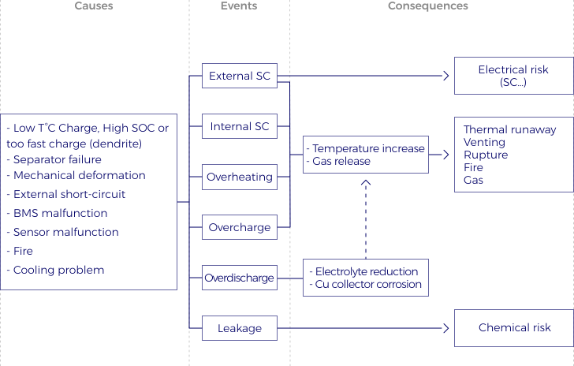

Energy Storage Systems (SSE) are complex devices and dealing with them expose to safety hazards of different types (chemical, electrical, thermal) with more or less criticality depending on the technology and the context.

In spite of the widespread application of lithium-ion batteries and their bright future, safety issue is still a severe obstacle in the technology development. These technologies based on organic solvent may cause runaway reactions, which are a major source of **industrial accidents**. Several dramatic incidents of overheating or battery fires have been reported in consumer products. For example, the global recall of Samsung’s Galaxy Note 7 in October 2016 or the full grounding of the entire Boeing 787 fleet in January 2013. Apart from the failure risks for users, these series of incidents brought battery makers to the forefront and the way they will address safety issues.

