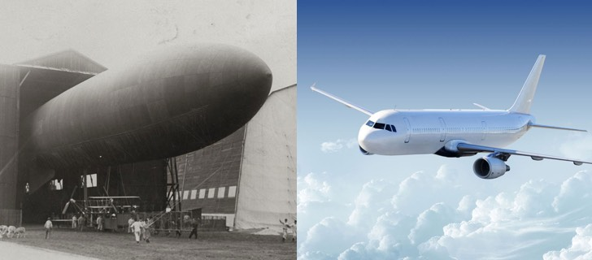

Le groupe Zodiac Aerospace, propriétaire de MTA plateforme d’essais SAS, est un équipementier et systémier aéronautique de rang mondial. Créé en 1896 le groupe réalise aujourd’hui plus de 5 milliards d’euros de chiffre d’affaire grâce à ses équipements et systèmes aéronautiques montés à bord des avions commerciaux, régionaux et hélicoptères. Le groupe emploie aujourd’hui plus de 35000 collaborateurs.

L’arrivée du groupe au capital de notre entreprise MTA en 2014 est une marque de confiance des équipes Zodiac envers le sérieux et la performance de notre société. Depuis lors, Zodiac s’est impliqué à investir et développer la plateforme MTA. Le leader de l’aéronautique a en particulier joué un rôle prépondérant dans l’adoption de **normes et de procédure de qualité et de sécurité** que MTA est aujourd’hui fière de proposer à ses clients.

Plus d’informations sur le groupe Zodiac Aerospace à cette adresse : 
[https://www.zodiacaerospace.com/fr/groupe/presentation](https://www.zodiacaerospace.com/fr/groupe/presentation)
