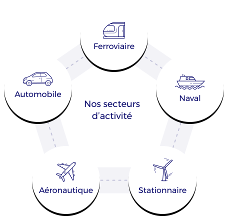

Notre plateforme MTA travaille historiquement avec le secteur automobile (voir [historique](#historique)), tout particulièrement autour du véhicule 100% électrique. Néanmoins, grâce aux compétences de ses équipes MTA sait aujourd’hui proposer ses services à une multitude de secteurs d’activités :
* Automobile, transport routier
* Ferroviaire
* Naval
* Aéronautique
* Stationnaire/ bâtiment

De par la flexibilité de son organisation et de ses équipes MTA sait également s’adresser à des entreprises de tailles très diverses. Nous nous mettons ainsi à votre service de façon personnalisée que vous soyez PME, ETI, collectivité public ou grand groupe international.

