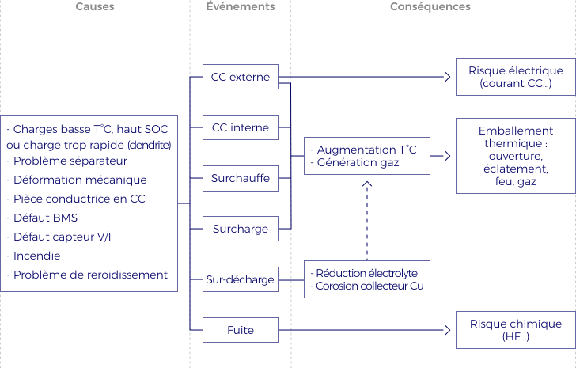

Le travail au contact de Systèmes de Stockage d’Énergie (SSE) présente des **risques** de différentes natures (chimique, électrique, thermique) et de criticité plus ou moindre en fonction de la technologie et du contexte.  

Les batteries Lithium-ion ont aujourd’hui une gravité d’événement parmi les plus importantes des technologies testées. En effet, ces technologies à base de solvant organique ont une réactivité très importante pouvant conduire à des **accidents industriels** très importants : rappel de l’ensemble des smartphones Samsung Galaxy Note 7 (octobre 2016) ou l’interdiction de vols de 3 mois des Boeing 787 (janvier 2013) par exemple. Hormis les risques très importants pour les utilisateurs, ces incidents sont également dangereux pour l’image du produit et de sa société.

