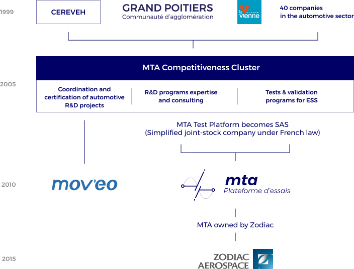

The history of MTA goes back over 20 years and originally was the **VEDELIC** programme, launched in 1994, bringing together long-standing regional partners in the electric car: Peugeot, Saft, Leroy Somer, Sagem and the regional universities. In the context of this VEDELIC programme, the first prototype car Peugeot 106 was built using a new traction system and showcased a lithium-ion battery system and a permanent magnet synchronous electric powertrain.

**CEREVEH** (for Development and Innovation Centre for Electric and Hybrid Vehicles) is founded in 1999 as a follow-up to the VEDELIC programme. A non-profit organization such as CEREVEH brings together local authorities, industry and national researchers in the sector and operates as a federative entity that paves the way for the setting up of cooperative R & D programs in the field of hybrid and electric vehicles.
With the creation of the Competitiveness Clusters in 2005, it is naturally that CEREVEH became The **“Pôle MTA” – MTA Cluster** (Competitiveness Cluster for Mobility and Advanced Transportation). The cluster then aims to centralize the various innovative mobility projects across France.

In 2009, at the request of the Ministry of Industry, the MTA Cluster merged part of its activities (animation and creation of R & D projects) with those of the Mov'eo cluster. In addition, all technical activities led to create MTA Test Platform, which has become MTA Test Platform SAS (Simplified joint-stock company under French law) since June 2012. From that time, we have been providing services that vary from EV and HEV electric components testing to industrial consulting and advisory services.

Pursuing its strategy for business growth and seeking a strong industrial input, MTA then decides to look for an industrial partner. Accordingly, in July 2014, **Zodiac Aerospace Group** took over the majority of shares of MTA Test Platform in order to develop its activities in the field of energy storage. In 2015, Zodiac took over MTA and thus owned the entire company. Since then, Zodiac Aerospace supports and develops the MTA marketing services to its various customers.

