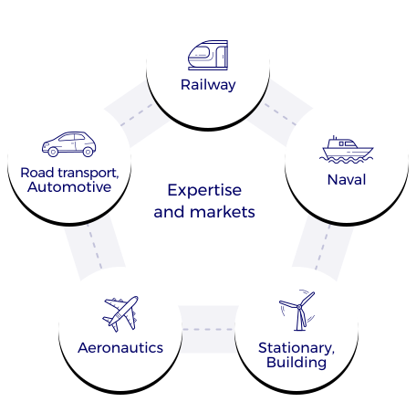

MTA platform works historically with the automotive sector (see history) and especially on the development of the fully electric vehicle. Through the skillsets of its team members, MTA further expands to provide testing services across various industries including:
* Automotive, road transport
* Railway
* Naval
* Aeronautics
* Stationary/Building

